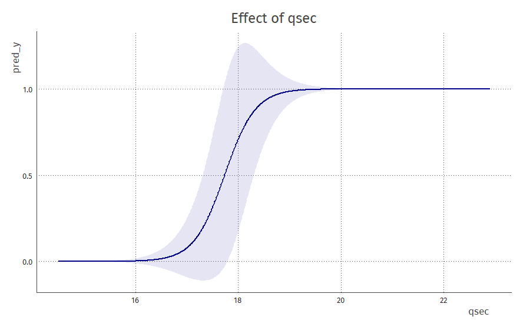

   
  <h2 align="center">memplot</h2>
   
  <h5 align="center">Marginal Effects at the Mean Plots</h5>

 

An intuitive way of interpreting coefficients in a model: take a 
typical case / sample, vary the variable of interest, and see how that changes 
the prediction. Works for categorical and continuous predictors.

