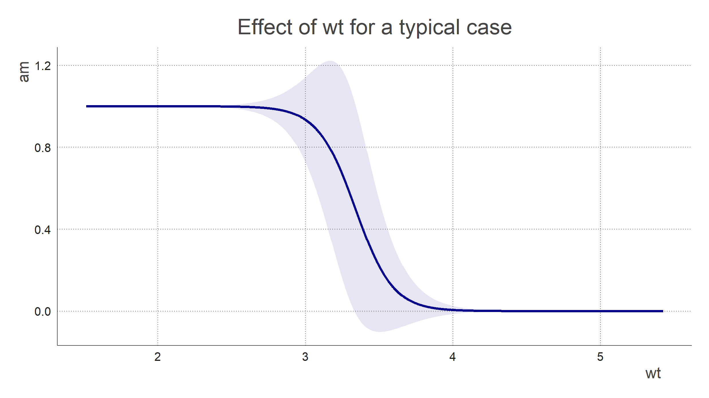

<p align="center">
  <h3 align="center">memplot</h3>
  <h5 align="center">Marginal Effects at the Mean Plots</h5>
</p>

An intuitive way of interpreting coefficients in a model: take a 
typical case / sample, vary the variable of interest, and see how that changes 
the prediction. Works for categorical and continuous predictors.

#### How to install
```r
devtools::install_github("vankesteren/memplot")
```

#### Example plots



